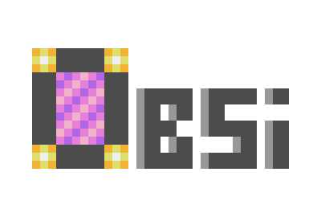

# Obsi 2D Game Engine (CC:Tweaked)

Obsi is a game engine that was designed specifically for CC:Tweaked.

Features of the game engine:
* It's 2D (I literally didn't implement triangles. DON'T EVEN TRY TO MAKE IT 3D.)
* Very similar to Love2D - if you are familiar with that engine, Obsi will be very easy to grasp!
* Customizable color palette - if you think the colors that CC provides you with are very limited, why not change them?
* Better image format - Obsi supports another image format besides `.nfp` called `.orli` (stands for "Obsi Run-Length Image"). This format can be up to 6-10x smaller than `.nfp`.
* 3 Different renderering APIs for optimal drawing to the terminal. Including: `pixelbox` (by Dev9551), `parea`, `hmon`.
* Changing rendering APIs on runtime (The default is `parea`, but it can be changed in the `config.lua` file of the game's folder.)
* Resizability - you can change the resolution ingame and the engine will still perform fine! (if it doesn't then it's your fault, probably)
* Tilesheets - if your image is a map of images with the same width and height, Obsi can directly give you an array of images using `obsi.graphics.newImagesFromTilesheet`.
* Support for noteblocks and formats like `.nbs` (Thanks to [Xella](https://github.com/Xella37/NBS-Tunes-CC)) and `.onb` (the latter is just mostly a csv).
* Playing/pausing/unpausing/stopping noteblock audio whenever you like.
* Scene manager + global state.

Features that are not implemented:
* Networking (Technically possible since 1.4.0, but no direct support for it yet.)
* Support for `.png` (Yeah, Dev9551, I've seen your png parser, but Holy Christ, it's too large!)
* Triangles (Did I mention that this is a 2D game engine?)
* Bundler/minifier - There are plans for Obsi to have a bundler in the repository, so that when you download it, you can bundle everything up and reduce its size significantly.

The engine doesn't have a release version, so you can either download it with `git clone` or `pastebin `

Credits:

[9551-Dev](https://github.com/9551-Dev) - For the Pixelbox rendering API.

[Xella37](https://github.com/Xella37) - For the original parsing function for NBS file format.